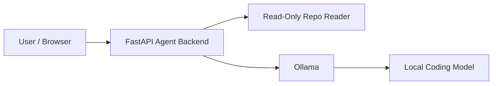

# Architecture

Phase 2 keeps the system intentionally narrow: a FastAPI backend accepts chat input, can safely inspect a local repository in read-only mode, and forwards prompts to a local Ollama instance running on the same machine.

