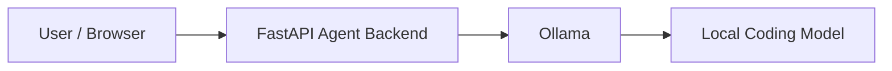

# Architecture

Phase 1 keeps the system intentionally narrow: a FastAPI backend accepts chat input and forwards the prompt to a local Ollama instance, which runs the coding model on the same machine.

